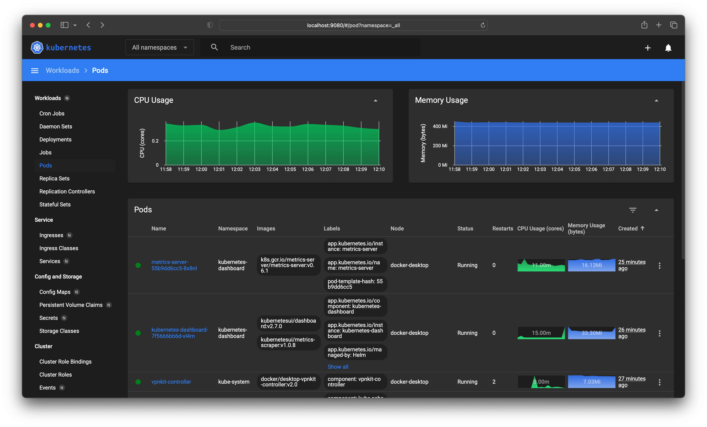

# Deploy Kubernetes Dashboard with Metrics Server using Terraform and Helm on Docker Desktop

This is a simple example of how to deploy the Kubernetes Dashboard and Metrics Server using Terraform and Helm on Docker Desktop.

### Step 1 - Start the local Kubernetes cluster from Docker Desktop
Go to Docker Desktop > Preferences > Kubernetes > Enable Kubernetes and click Apply & Restart


### `Optional` Step 2 - Set the kubectl context to Docker Desktop
If you have multiple kubectl contexts, you can set the current context to Docker Desktop using the following command:
```bash
kubectl config use-context docker-desktop
```

### Step 3 - Install Terraform for macOs (if not already installed)
Download and install Terraform from https://www.terraform.io/downloads.html
```bash
brew tap hashicorp/tap && brew install hashicorp/tap/terraform
```

### Step 4 - Clone this repository
```bash
git clone https://github.com/garis-space/tf-helm-kubernetes-dashboard-and-metrics-server.git && cd tf-helm-kubernetes-dashboard-and-metrics-server
```

### Step 5 - Initialize Terraform
```bash
terraform init
```

### Step 6 - Deploy the Kubernetes Dashboard and Metrics Server
```bash
terraform apply
```

### Step 7 - Access the Kubernetes Dashboard
```bash
# Open the Kubernetes Dashboard (please wait a few minutes for the Kubernetes Dashboard to start and the Metrics Server to collect data)
open https://localhost:9080
```



### `Optional` Step 8 - Clean up
```bash
terraform destroy
```
